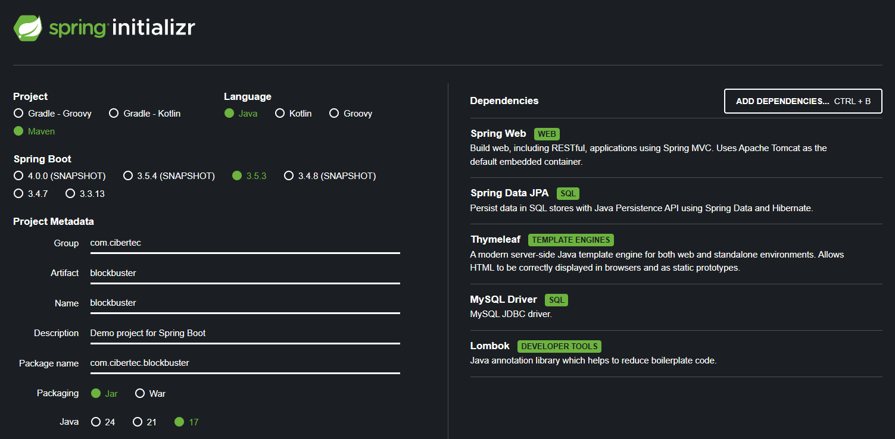

# Evaluación LP2

## Descripción del Proyecto
Este proyecto es una aplicación de gestión de películas desarrollada en Spring Boot. La aplicación permite a los usuarios gestionar alquileres de películas.

## Autor
Rafael Anderson Ponte Gaitán

## Tecnologías utilizadas
https://start.spring.io/
