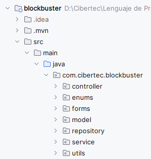
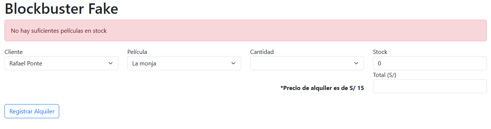
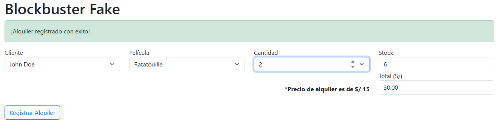

# Evaluación LP2

## Descripción del Proyecto
Este proyecto es una aplicación de gestión de películas desarrollada en Spring Boot. La aplicación permite a los usuarios gestionar alquileres de películas.

## Autor
Rafael Anderson Ponte Gaitán :^)

## Tecnologías utilizadas
https://start.spring.io/

## Información

Ruta para el proyecto: *http://localhost:8090/alquiler*

### Distribución de carpetas

### Script creación de base de datos
USE blockbuster;

CREATE TABLE alquiler (
id BIGINT NOT NULL AUTO_INCREMENT,
estado ENUM('ACTIVO','DEVUELTO','RETRASADO') DEFAULT NULL,
fecha DATE NOT NULL,
id_cliente BIGINT NOT NULL,
total INT NOT NULL,
PRIMARY KEY (id)
);

CREATE TABLE cliente (
id BIGINT NOT NULL AUTO_INCREMENT,
email VARCHAR(255) NOT NULL,
nombre VARCHAR(255) NOT NULL,
PRIMARY KEY (id)
);

CREATE TABLE detalle_alquiler (
alquiler_id BIGINT NOT NULL,
pelicula_id BIGINT NOT NULL,
cantidad INT NOT NULL,
PRIMARY KEY (alquiler_id, pelicula_id)
);

CREATE TABLE pelicula (
id BIGINT NOT NULL AUTO_INCREMENT,
genero VARCHAR(255) DEFAULT NULL,
stock INT NOT NULL,
titulo VARCHAR(255) NOT NULL,
PRIMARY KEY (id)
);

INSERT INTO cliente (nombre, email) VALUES
('Rafael Ponte', 'rafaelponte@gmail.com'),
('John Doe', 'johndoe@gmail.com'),
('Fredd Farias', 'fredd_farias@gmail.com');

INSERT INTO pelicula (titulo, genero, stock) VALUES
('La monja', 'Terror', 5),
('Marvel Avengers: Infinity War', 'Ciencia ficción', 10),
('Ratatouille', 'Animación', 6),
('El Rey León', 'Animación', 8),
('Titanic', 'Drama', 4),
('El Padrino', 'Crimen', 3),
('Forrest Gump', 'Drama', 7),
('Jurassic Park', 'Ciencia ficción', 9),
('Interstellar', 'Ciencia ficción', 5),
('Spider-Man: No Way Home', 'Acción', 6);

### Funcionalidad
- Error

- Guardado exitoso
